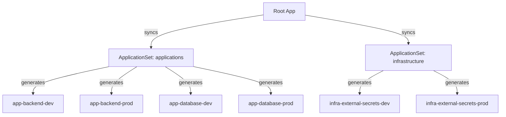

# Quick Start - ApplicationSets Pattern

## 🎯 TL;DR

**Old way (DELETED):**
```bash
./deploy.py management
./scripts/setup-argocd-management-apps.sh  # ← Script này đã XÓA
```

**New way (CURRENT):**
```bash
./deploy.py  # Tự động chạy bootstrap mới
```

---

## 📦 What You Have Now

### Structure
```
argocd/
├── appsets/          ← ApplicationSets (matrix: 2 apps × 3 envs)
├── bootstrap/        ← Root App (sync appsets + notifications)
├── notifications/    ← Slack alerts
├── projects/         ← Dev/Prod/Staging/Infrastructure projects
└── rbac/             ← User permissions
```

### Deployment Pattern


---

## 🚀 Deploy Full System

### 1. Deploy All (Management + Dev + Prod)
```bash
cd ~/Downloads/practice_RKE2
./deploy.py
```

**What happens:**
- ✅ Management cluster: ArgoCD installed
- ✅ Dev/Prod clusters: Rancher + ESO installed
- ✅ **NEW:** Bootstrap applied → ApplicationSets deployed
- ✅ **NEW:** 6 Applications auto-generated (2 apps + 1 infra) × 2 envs
- ✅ ArgoCD syncs from Git (branch: dev for dev, main for prod)

---

### 2. Deploy Only Management
```bash
./deploy.py management
```

Then register dev/prod clusters:
```bash
./scripts/create-argocd-cluster-secrets.sh
./scripts/deploy-argocd-bootstrap.sh
```

---

## 🔧 Add New Service

**Before (Old):** Edit 5 files
```
argocd/applications/base/values.yaml
argocd/applications/base/templates/application.yaml
argocd/applications/overlays/dev/values.yaml
argocd/applications/overlays/prod/values.yaml
scripts/setup-argocd-management-apps.sh
```

**Now (New):** Edit 1 file
```yaml
# argocd/appsets/appset-applications.yaml
generators:
- list:
    elements:
    - app: backend
      path: k8s_helm/generic-app
      namespace: meo-stationery
    - app: database
      path: k8s_helm/generic-app
      namespace: database
    - app: frontend        # ← ADD THIS
      path: k8s_helm/generic-app
      namespace: meo-stationery
      ignoreDifferences:
      - group: apps
        kind: Deployment
        jsonPointers:
        - /spec/replicas
```

Git push → ArgoCD auto-generates:
- `app-frontend-dev`
- `app-frontend-prod`

---

## 🌍 Add New Environment (Staging)

```yaml
# argocd/appsets/appset-applications.yaml
- list:
    elements:
    - env: dev
      server: https://10.1.101.198:6443
      prune: "true"
    - env: prod
      server: https://10.2.101.11:6443
      prune: "false"
    - env: staging        # ← ADD THIS
      server: https://10.3.101.50:6443
      prune: "true"
```

Git push → ArgoCD auto-generates:
- `app-backend-staging`
- `app-database-staging`

---

## 📊 Monitoring

### Check Status
```bash
# ApplicationSets
kubectl get applicationsets -n argocd

# Generated Applications
kubectl get applications -n argocd -o wide

# Sync status
kubectl get applications -n argocd -o custom-columns=NAME:.metadata.name,SYNC:.status.sync.status,HEALTH:.status.health.status
```

### Check Notifications
```bash
# ConfigMap
kubectl get cm argocd-notifications-cm -n argocd -o yaml

# Secret (Slack token)
kubectl get secret argocd-notifications-secret -n argocd
```

### UI
```bash
# ArgoCD UI
http://argocd.local

# Port-forward backup
kubectl port-forward svc/argocd-server -n argocd 8080:443
# https://localhost:8080
```

---

## ⚠️ Important Notes

1. **Git Branches:**
   - Dev apps → sync from `dev` branch
   - Prod apps → sync from `main` branch (protected)

2. **Prune Policy:**
   - Dev: `prune: true` (auto-delete removed resources)
   - Prod: `prune: false` (manual deletion for safety)

3. **Secrets:**
   - Still using External Secrets Operator (ESO)
   - AWS Secrets Manager → K8s Secrets
   - No plaintext secrets in Git ✅

4. **RBAC:**
   - `dev-role`: Can only sync dev apps
   - `prod-role`: Can sync both dev + prod apps
   - See: `argocd/SETUP-RBAC.md`

---

## 🔥 Common Commands

```bash
# Full deploy
./deploy.py

# Redeploy bootstrap only
./scripts/deploy-argocd-bootstrap.sh

# Watch Applications
kubectl get apps -n argocd -w

# Force sync an app
argocd app sync app-backend-dev

# View ApplicationSet template output
kubectl get applicationset applications -n argocd -o yaml | grep -A 50 "template:"
```

---

## 📚 Learn More

- **ApplicationSets:** `APPLICATIONSETS-MIGRATION-GUIDE.md`
- **ArgoCD Setup:** `argocd/README.md`
- **Bootstrap:** `argocd/bootstrap/README.md`
- **Notifications:** `argocd/notifications/README.md`
- **Cleanup Details:** `CLEANUP-SUMMARY.md`
